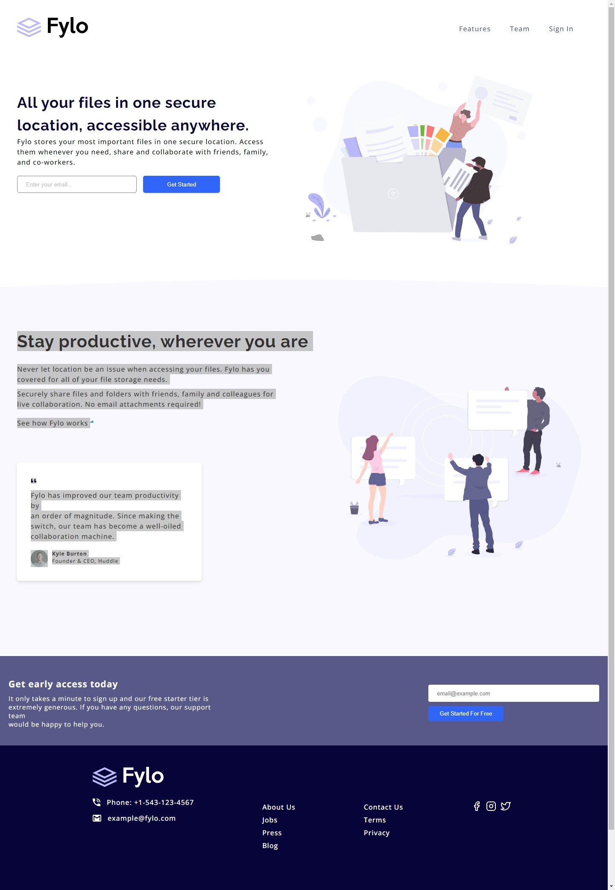
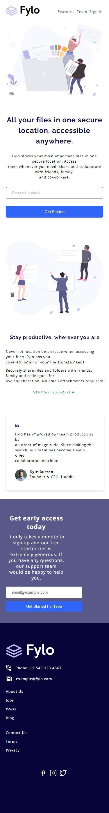

# Fylo Landing Page Project.
#### *by Adu Atiloye and Onwuka Ogechukwu*
---

## Decription:
---
- This project is a recreation of a landing page for a website carried out as a group in order to get familiar with GitHub collaboration, workspace and working as a team.
- The programming languages used for the project are:
1. HTML
2. CSS
3. And MD for the Readme file.
- The page was made responsive for screen widths of max 1440px for PCs, and 375px for mobile devices.
---

## Screenshot of desktop site.

---

## Screenshot of mobile site.

---

